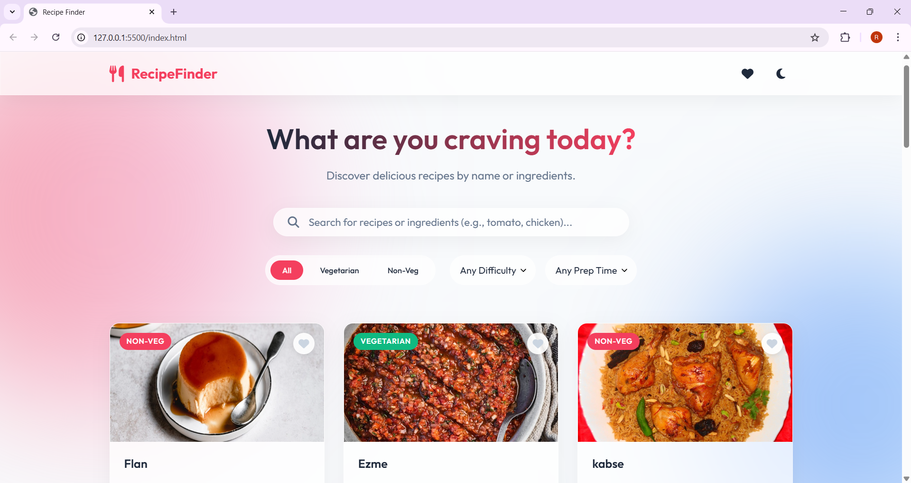
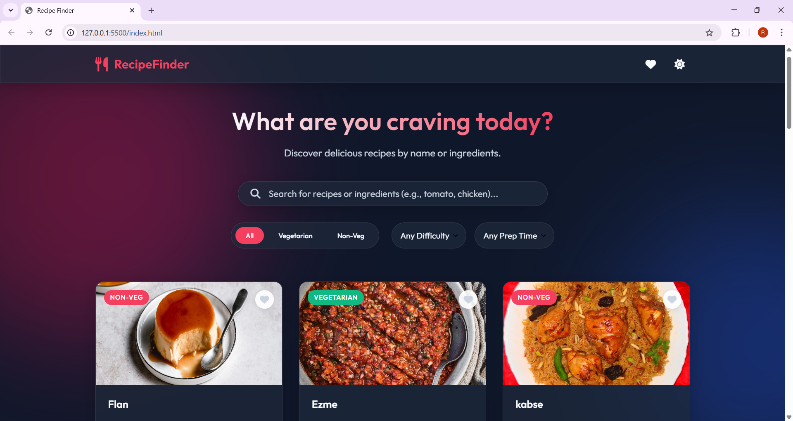
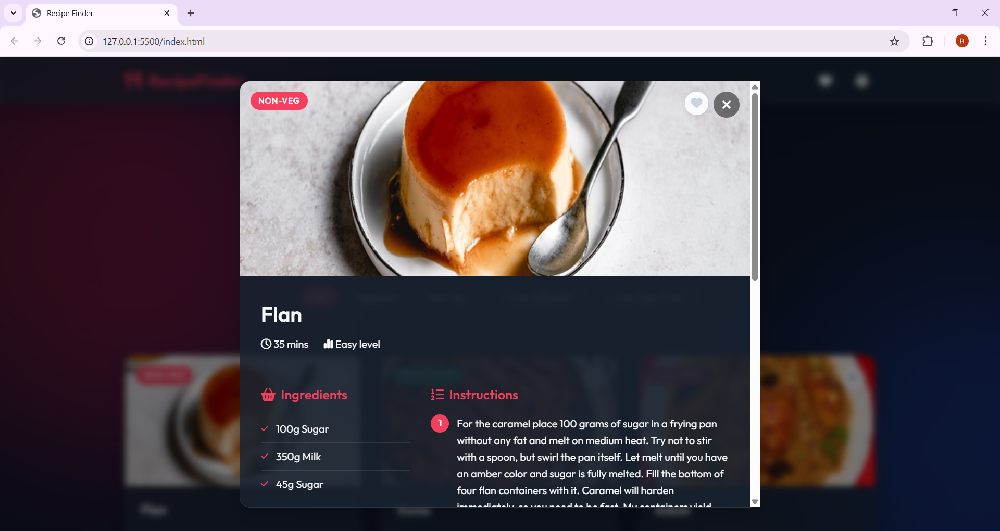

# 🍳 Recipe Finder

A stunning, modern, and responsive web application that helps you discover delicious recipes from around the world based on ingredients or dish names. Powered by HTML, CSS, JavaScript, and live data from TheMealDB API.

[](http://127.0.0.1:5500/index.html)


---

## 📸 Screenshots

### Light Mode


### Dark Mode


### Recipe Details


---

## ✨ Features

- **🔍 Smart Search Engine**
  - **Multi-Ingredient Search**: Search using multiple ingredients separated by spaces or commas (e.g., `egg, chicken, cheese`). The app seamlessly fetches and combines results from across the globe.
  - **Name Fallback**: Intelligently falls back to searching by dish name if ingredient matches are not found.
- **🛡️ Strict Vegetarian Filtering**
  - Instant categorical filtering completely screens all API ingredients against an exhaustive non-vegetarian keyword list (chicken, beef, pork, fish, egg, etc.) to guarantee 100% accurate vegetarian classification.
- **💎 Modern Aesthetics**
  - Sleek **Glassmorphism** styling with animated background blobs for a live, premium feel.
  - Custom CSS variables with a native **Dark Mode Toggle**.
- **❤️ Local Favorites System**
  - Save your favorite recipes to `localStorage`. Your favorites persist even after closing the browser.
- **⚡ Lazy Loading**
  - Efficiently fetches the heavy recipe details (like full ingredient lists and step-by-step instructions) only when a recipe card is opened.
- **📱 Fully Responsive** 
  - Works beautifully on desktop, tablet, and mobile devices.

---

## 🚀 Live Demo & Usage
Since this project uses a pure frontend architecture (`index.html`, `styles.css`, `app.js`), you do not need any local servers or backend environments to run it!

1. **Clone the repository:**
   ```bash
   git clone https://github.com/your-username/recipe-finder.git
   ```
2. **Open the App:**
   Simply double-click `index.html` in the project folder to open it in your default web browser.
3. **Start Searching!**
   Type an ingredient like `tomato` or `salmon` in the search bar and watch the recipes populate.

---

## 🛠️ Technology Stack
- **HTML5**: Semantic structure and SVG integrations.
- **Vanilla CSS3**: Custom properties, Flexbox/Grid layouts, backdrop filters (glassmorphism), and keyframe animations. Dark mode implementation via `data-theme` attribute.
- **Vanilla JavaScript (ES6+)**: Asynchronous API fetching (`fetch`, `Promises`), state management, DOM manipulation, and `localStorage` integration.
- **TheMealDB API**: Provides the live, dynamic database for all recipes, images, and instructions.

---

## 📂 Project Structure
```text
recipe_finder/
│
├── index.html       # Main HTML structure and UI layout
├── styles.css       # Core styling, animations, and dark mode configuration
├── app.js           # Frontend logic, API handling, and state management
├── recipes.json     # (Optional/Legacy) Local fallback dataset 
└── README.md        # Project documentation
```

---

## 🤝 Contributing
Contributions, issues, and feature requests are welcome! 
If you have suggestions for improving this project:
1. Fork the project.
2. Create your feature branch (`git checkout -b feature/AmazingFeature`).
3. Commit your changes (`git commit -m 'Add some AmazingFeature'`).
4. Push to the branch (`git push origin feature/AmazingFeature`).
5. Open a Pull Request.

---

## 👨‍💻 Author

**Roshan Ali Mohammad**

## 📝 License
This project is open-source and available under the [MIT License](LICENSE).
